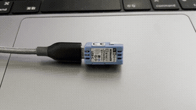

# M5Stack NanoC6 Bare-Metal Swift

A bare-metal Swift project for the [M5Stack NanoC6](https://docs.m5stack.com/en/core/M5NanoC6) (ESP32-C6), running **without any C, assembly, or ESP-IDF** — pure Embedded Swift from bootloader to LED blink.

<p align="center">
  
</p>

## What This Does

- Boots directly into Swift `@main` — no C startup code
- Disables all 4 watchdog timers via volatile register access
- Drives GPIO7 (blue status LED) through direct IO_MUX / GPIO register manipulation
- Outputs serial messages over USB Serial JTAG
- Implements microsecond delays using the SYSTIMER peripheral
- Provides runtime stubs (`posix_memalign`, `free`, `memset`, `memcpy`, `memmove`) entirely in Swift, with a free-list heap allocator (supporting real deallocation and coalescing) and memory primitives isolated in dedicated targets

## Project Structure

```
├── Sources/
│   ├── HeapAllocator/        # Free-list allocator (posix_memalign/free)
│   │   └── HeapAllocator.swift
│   ├── MemoryPrimitives/     # memset/memcpy/memmove stubs (isolated target)
│   │   └── MemoryPrimitives.swift
│   ├── Bootloader/           # 2nd stage bootloader (pure Swift)
│   │   ├── Bootloader.swift  # Entry point — flash read, MMU setup, jump to app
│   │   ├── ClockConfig.swift # PLL clock initialization (XTAL → 160MHz)
│   │   ├── FlashRead.swift   # SPI flash reading via direct SPI1 registers
│   │   ├── FlashConfig.swift # SPI clock and read mode configuration
│   │   ├── MMU.swift         # Flash MMU page table configuration
│   │   ├── Watchdog.swift    # WDT disable
│   │   └── Delay.swift       # SYSTIMER-based delay
│   ├── Application/          # Main application
│   │   ├── Application.swift # @main entry point — LED blink loop
│   │   └── Support/
│   │       ├── Startup.swift        # .bss clearing (clearBSS)
│   │       ├── Watchdog.swift       # WDT disable (TIMG0/1, LP_WDT, SWD)
│   │       ├── Delay.swift          # SYSTIMER-based microsecond delay
│   │       ├── Serial.swift         # USB Serial JTAG output
│   │       └── VolatileRegister.swift
│   └── Registers/            # Auto-generated register definitions (SVD2Swift)
│       ├── Device.swift
│       ├── GPIO.swift
│       ├── IO_MUX.swift
│       ├── SYSTIMER.swift
│       └── USB_DEVICE.swift
├── Tools/
│   ├── elf2image.swift           # ELF to ESP flash image converter
│   ├── write-flash.swift         # Flash writer via serial (SLIP protocol)
│   ├── image-info.swift          # Image header inspector
│   └── gen-partition-table.swift # Partition table generator
├── linker/
│   ├── esp32c6.ld            # Application linker script
│   └── bootloader.ld         # Bootloader linker script
├── toolset.json              # Application compiler & linker flags
├── toolset-bootloader.json   # Bootloader compiler & linker flags
├── Makefile                  # Build & flash automation
├── Package.swift
└── docs/                     # Detailed documentation for each subsystem
```

## Prerequisites

| Tool | Version | Notes |
|------|---------|-------|
| Swift 6.3 toolchain | `org.swift.630202603201a` | Must support Embedded Swift & RISC-V |
| macOS | — | Uses `xcrun` for toolchain discovery |

No ESP-IDF installation required. The `Tools/` directory contains pure Swift replacements for `esptool.py` (ELF-to-image conversion, flash writing, image inspection).

## Quick Start

### 1. Install Swift 6.3

Install [swiftly](https://swiftlang.github.io/swiftly/) (Swift toolchain manager), then install Swift 6.3:

```bash
# Install swiftly
curl -L https://swiftlang.github.io/swiftly/swiftly-install.sh | bash

# Install Swift 6.3
swiftly install 6.3

# Set the toolchain for this project
export TOOLCHAINS=org.swift.630202603201a
```

### 2. Build

```bash
make build
```

This runs `swift build` for the `riscv32-none-none-eabi` target, then converts the ELF to an ESP flash image using `Tools/elf2image.swift`.

### 3. Flash

```bash
make flash
```

Writes the bootloader, partition table, and application to the NanoC6 using `Tools/write-flash.swift`.

### 4. Monitor

```bash
screen /dev/cu.usbmodem* 115200
```

You should see `Swift: blinking` messages and the blue LED toggling every 500ms.

## How It Works

The 2nd stage bootloader (also written in Swift, `Sources/Bootloader/`) handles low-level initialization (BSS clearing, PLL clock setup to 160MHz, flash SPI configuration, segment loading, Flash MMU), then jumps to the application's `@main` entry point. Everything is pure Swift:

1. **Disable watchdogs** — All 4 watchdogs (TIMG0/1 MWDT, RWDT, SWD) are fully disabled including stage actions and flashboot mode, following ESP-IDF's approach
2. **Configure GPIO7** — Set IO_MUX to GPIO function, route through GPIO matrix, enable output
3. **Blink loop** — Toggle output via W1TS/W1TC registers with SYSTIMER-based delays

Register access uses [apple/swift-mmio](https://github.com/apple/swift-mmio) with definitions generated from the ESP32-C6 SVD file.

## Documentation

Detailed write-ups for each subsystem are in the [`docs/`](docs/) directory:

| Doc | Topic |
|-----|-------|
| [01-toolchain](docs/01-toolchain.md) | Toolchain setup |
| [02-bootloader-flash-image](docs/02-bootloader-flash-image.md) | Boot sequence & flash image format |
| [03-linker-script](docs/03-linker-script.md) | Memory map & linker script design |
| [04-startup](docs/04-startup.md) | Pure Swift startup & watchdog disabling |
| [05-heap-and-memory-stubs](docs/05-heap-and-memory-stubs.md) | Heap allocator & memory stubs |
| [06-swift-mmio](docs/06-swift-mmio.md) | swift-mmio integration & SVD2Swift |
| [07-gpio](docs/07-gpio.md) | GPIO driver implementation |
| [08-delay-serial](docs/08-delay-serial.md) | SYSTIMER delay & USB Serial JTAG output |
| [09-build-system](docs/09-build-system.md) | Build pipeline (SwiftPM + toolset + Make) |
| [10-tools](docs/10-tools.md) | Swift-based tools (elf2image, write-flash, image-info, gen-partition-table) |

## Acknowledgments

- [pico-bare-swift](https://github.com/kishikawakatsumi/pico-bare-swift) — Inspiration for the `@main` bare-metal pattern and `VolatileMappedRegister` usage
- [esp32-c6-swift-baremetal](https://github.com/georgik/esp32-c6-swift-baremetal) — Reference for ESP32-C6 + Swift bare-metal approach
- [apple/swift-mmio](https://github.com/apple/swift-mmio) — MMIO register access framework and SVD2Swift code generator

## License

This project is licensed under the [Apache License 2.0](LICENSE).
